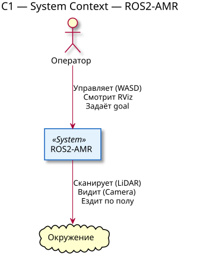
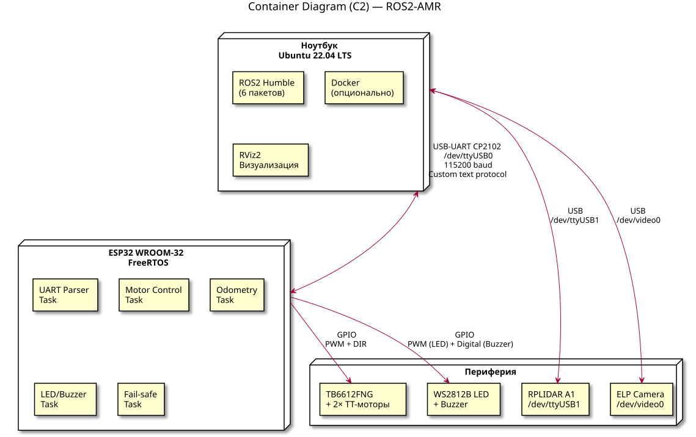
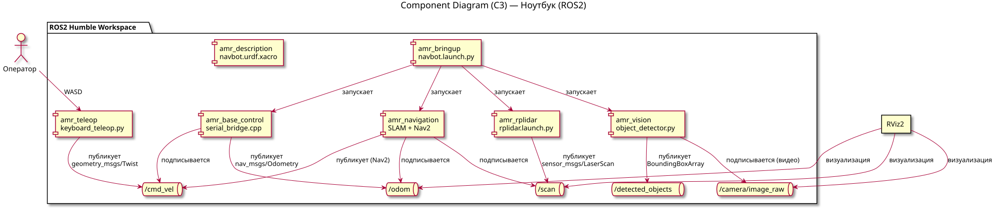
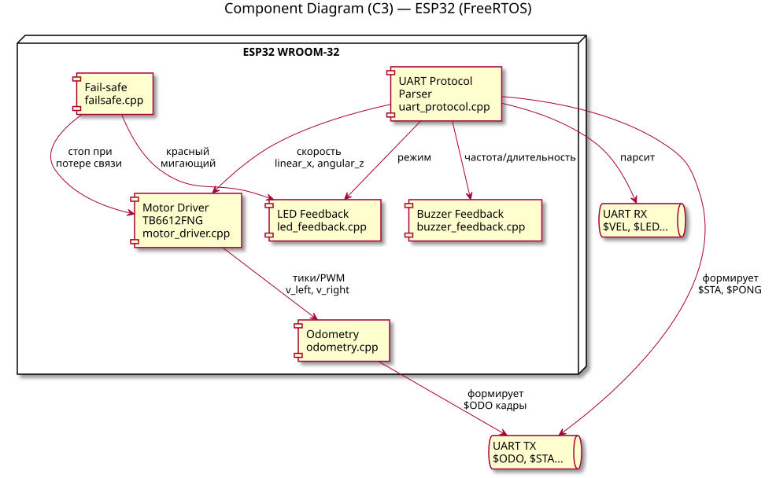

# Архитектура ROS2-AMR

> Документ описывает системную архитектуру автономного мобильного робота.
> МОдель: С4
> Версия: 1.0 | Дата: 2026-06-09 | Автор: denis

---

## Введение

Этот документ описывает архитектуру автономного мобильного робота (AMR) на базе ROS2 Humble.  
Система использует **двухуровневую распределённую архитектуру**: ноутбук (high-level, алгоритмы) + ESP32 (low-level, исполнение).

**Ключевые ограничения (constraints):**
- Бюджет: 30–50 тыс. ₽
- Срок: 8 недель (июнь–август 2026)
- Железо: шасси 2WD, TT-моторы, ESP32, RPLIDAR A1, ELP-камера
- Связь: USB-UART (CP2102) 115200 baud

## 1. C1 — System Context (Контекст)

Границы системы. Робот взаимодействует с оператором (управление, RViz) и окружением (сканирование, движение).

## 2. C2 — Container Diagram

Система разделена на три физических контейнера, соединённых проводными интерфейсами:

| Контейнер | Технология | Роль в системе |
|-----------|-----------|----------------|
| **Ноутбук (Ubuntu 22.04)** | ROS2 Humble, Docker, Python/C++ | High-level вычислитель: SLAM, планирование пути, компьютерное зрение, телеоперация. |
| **ESP32 WROOM-32** | FreeRTOS (Arduino-Framework / PlatformIO), C++ | Low-level микроконтроллер: управление моторами, парсинг UART, индикация, fail-safe. |
| **Периферия** | RPLIDAR A1, ELP USB Camera, TB6612FNG, LED, Buzzer | Сенсоры (восприятие) и актуаторы (движение, сигнализация). |

**Ключевой интерфейс:** Ноутбук и ESP32 связаны через **USB-UART мост CP2102** (`/dev/ttyUSB0`) на скорости **115200 baud**. Это единственная точка связи между алгоритмическим и исполнительным уровнями. Все команды и данные проходят через неё.

## 3. C3 — Component Diagram: Ноутбук (ROS2)

Внутри ноутбука работает ROS2 Humble с шестью пакетами, каждый из которых отвечает за изолированную функцию:

| Пакет | Язык | Назначение | Входные данные | Выходные данные |
|-------|------|-----------|----------------|-----------------|
| `amr_bringup` | Python | Единый launch-файл, запускающий всю систему одной командой. | — | Запуск других пакетов |
| `amr_teleop` | Python | Телеоперация с клавиатуры (WASD). | Keyboard events | `/cmd_vel` (geometry_msgs/Twist) |
| `amr_base_control` | C++ | Мост между ROS2 и ESP32. Подписывается на `/cmd_vel`, публикует `/odom`. | `/cmd_vel`, UART RX | UART TX, `/odom` (nav_msgs/Odometry) |
| `amr_description` | URDF/Xacro | Модель робота для визуализации и tf2. | — | `robot_description`, tf tree |
| `amr_navigation` | YAML/Python | SLAM Toolbox + Nav2 + AMCL. Построение карты и автономная навигация. | `/scan`, `/odom` | `/map`, `/cmd_vel` (Nav2) |
| `amr_rplidar` | Python | Драйвер RPLIDAR A1. | USB-данные лидара | `/scan` (sensor_msgs/LaserScan) |
| `amr_vision` | Python | ELP-камера + OpenCV/YOLO. Детекция объектов. | `/camera/image_raw` | `/detected_objects` |

**Принцип коммуникации:** Все пакеты общаются через ROS2 topics (pub/sub).

---

## 4. C3 — Component Diagram: ESP32 (FreeRTOS)

ESP32 работает под управлением FreeRTOS с многозадачностью. Каждая задача отвечает за свой домен:

| Задача (модуль) | Файл | Назначение | Связи |
|-----------------|------|-----------|-------|
| **UART Protocol** | `uart_protocol.cpp` | Приём/передача кадров, парсинг, валидация checksum. | Связь с ноутбуком через UART |
| **Motor Driver** | `motor_driver.cpp` | Управление TB6612FNG: PWM, направление (DIR), скорость. | Получает целевую скорость от UART |
| **Odometry** | `odometry.cpp` | Расчёт пройденного пути по PWM (без энкодеров). | Отправляет `$ODO` кадры на ноутбук |
| **LED Feedback** | `led_feedback.cpp` | Индикация состояния: idle, движение, ошибка, emergency. | Получает режим от UART |
| **Buzzer Feedback** | `buzzer_feedback.cpp` | Звуковые сигналы: старт, стоп, ошибка. | Получает команду от UART |
| **Fail-safe** | `failsafe.cpp` | Watchdog: мониторинг связи, emergency stop, ребут. | Может остановить моторы напрямую |

**Почему FreeRTOS:** Моторы не должны ждать, пока камера обработает кадр. UART не должен блокироваться из-за звукового сигнала. Многозадачность гарантирует, что critical tasks (моторы, fail-safe) работают в real-time.

---

## 5. Поток данных (Data Flow)

Как команда движения превращается в движение робота и обратно в одометрию:

| Шаг | Источник | Действие | Получатель | Интерфейс / Топик |
|-----|----------|----------|------------|-------------------|
| 1 | Оператор | Нажимает клавишу `W` | `amr_teleop` | Keyboard input |
| 2 | `amr_teleop` | Формирует сообщение о скорости | ROS2 | `/cmd_vel` (Twist) |
| 3 | `amr_base_control` | Получает Twist, конвертирует в линейную и угловую скорость | `SerialBridge` (внутри пакета) | Внутренний вызов |
| 4 | `SerialBridge` | Формирует кадр протокола | ESP32 | UART: `$VEL,0.25,0.0*A3` |
| 5 | ESP32 `UARTParser` | Парсит кадр, проверяет checksum | `MotorDriver` | Внутри ESP32 |
| 6 | `MotorDriver` | Устанавливает PWM и направление | TB6612FNG | GPIO (PWM + DIR) |
| 7 | TB6612FNG | Крутит моторы | Колёса | Электрический сигнал |
| 8 | `Odometry` | Считает скорость по текущему PWM | `UARTParser` | Внутри ESP32 |
| 9 | `UARTParser` | Формирует кадр одометрии | Ноутбук | UART: `$ODO,v_l,v_r,dt*CS` |
| 10 | `SerialBridge` | Парсит кадр, публикует в ROS2 | `amr_navigation`, RViz | `/odom` (Odometry) |

**Latency:** Полный цикл занимает **20–50 мс** (UART + ROS2 overhead + FreeRTOS scheduling).  
**Почему это приемлемо:** Максимальная скорость робота ~0.5 м/с. За 50 мс робот проедет 2.5 см — это меньше погрешности LiDAR и допустимо для indoor-навигации.

---

## 6. Архитектурные решения (ADR)

### ADR-001: Двухуровневая архитектура (ноутбук + ESP32)

**Контекст:** Нужен вычислитель для SLAM, Nav2 и компьютерного зрения. Одновременно нужен real-time контроль моторов с точностью до миллисекунд.

**Рассмотренные варианты:**
- Raspberry Pi 4 как единый контроллер (всё-в-одном).
- STM32F4 + ноутбук (STM32 вместо ESP32).
- NVIDIA Jetson Nano + Arduino.

**Решение:** Ноутбук (x86, 8GB RAM) для high-level + ESP32 WROOM-32 для low-level.

**Обоснование:**
- Ноутбук уже есть → 0 ₽. ESP32 уже есть → 0 ₽.
- Raspberry Pi 4 не справляется одновременно с Nav2 + SLAM + CV (требуется 4GB+ RAM и нормальная CPU-производительность).
- ESP32 даёт 34 GPIO, встроенный Wi-Fi (резервный канал), 240 MHz и FreeRTOS — достаточно для 2WD-шасси.
- Ноутбук легко заменить на любой другой x86-ПК или NUC при масштабировании.

**Trade-off:** Дополнительный кабель USB-UART между уровнями. Зато полная заменяемость: можно поменять ноутбук, не трогая ESP32, и наоборот.

---

### ADR-002: USB-UART вместо CAN, I2C или Wi-Fi

**Контекст:** Связь между ноутбуком и ESP32 должна быть надёжной, дешёвой и простой в отладке.

**Рассмотренные варианты:**
- CAN bus (требует трансивера TJA1051, сложная разводка).
- I2C (короткие кабели, нестабилен на расстоянии >30 см, нет готовых USB-мостов).
- Wi-Fi (latency 10–100 мс, непредсказуемый, требует настройки сети).
- USB-HID (сложнее в реализации на ESP32).

**Решение:** USB-UART мост CP2102, 115200 baud.

**Обоснование:**
- CP2102 уже есть в наличии → 0 ₽.
- 115200 baud ≈ 14 KB/s. Пиковый поток данных: одометрия (50 Гц) + статус (10 Гц) ≈ 1.5 KB/s. Запас по пропускной способности — 9×.
- USB-UART не требует драйверов на Ubuntu (ядро поддерживает `cp210x` из коробки).

**Trade-off:** Нет встроенной CRC на уровне физического протокола (реализована XOR-чексумма в прикладном кадре). Нет multi-master (не требуется для топологии point-to-point).

---

### ADR-003: Текстовый протокол вместо бинарного

**Контекст:** Формат кадров UART между ноутбуком и ESP32.

**Рассмотренные варианты:**
- Бинарный протокол (`struct` packing, protobuf, ROS2-serial).
- Текстовый CSV-like: `$TYPE,arg1,arg2*CHECKSUM`.

**Решение:** Текстовый протокол.

**Обоснование:**
- **Отладка:** Можно отправить команду вручную через терминал: `echo "$VEL,0.25,0.0*A3" > /dev/ttyUSB0`. Для бинарного протокола нужен специальный инструмент.
- **Парсинг:** `sscanf` / `String.split` — простой код, не требует внешних библиотек. На ESP32 экономит память (не нужен nanopb).
- **Расширяемость:** Добавить новый тип сообщения = добавить `case` в `switch`. Не меняется формат заголовка.

**Trade-off:** Больший размер кадра (~20 байт vs 8 байт бинарного). При 115200 baud и частоте 50 Гц это незначительно (~1 KB/s лишнего трафика).

---

### ADR-004: ROS2 Humble в Docker

**Контекст:** Разработческое окружение на ноутбуке.

**Рассмотренные варианты:**
- Нативная установка ROS2 Humble на Ubuntu 22.04.
- Docker-контейнер с ROS2.

**Решение:** Docker + официальный образ `osrf/ros:humble-desktop`.

**Обоснование:**
- **Воспроизводимость:** `docker build` на любом ПК даёт идентичное окружение. Работает на твоём ноутбуке, на CI/CD, на машине коллеги.
- **Изоляция:** Эксперименты с Nav2, установка пакетов, изменения в `.bashrc` не ломают основную систему.
- **CI/CD:** GitHub Actions использует тот же Docker-образ, что и локальная разработка. «У меня работает» → «Везде работает».

**Trade-off:** Нужен `--network host` для ROS2 multicast (DDS). Небольшой оверхед по диску (~2 GB образ).

---

### ADR-005: SLAM Toolbox вместо Google Cartographer

**Контекст:** 2D-SLAM для построения карты помещения в реальном времени.

**Рассмотренные варианты:**
- Google Cartographer (требует ROS1 bridge или сложную настройку в ROS2).
- gmapping (только ROS1, не поддерживает ROS2 нативно).
- Hector SLAM (нет одометрии, только scan-matching — менее стабилен).
- SLAM Toolbox (`slam_toolbox`).

**Решение:** SLAM Toolbox.

**Обоснование:**
- Нативный пакет ROS2 (не требует мостов с ROS1).
- Поддерживает **lifelong mapping** — карта обновляется при изменении окружения (передвижение мебели).
- Хорошо работает с RPLIDAR A1 (360°, 5.5 Гц, диапазон 12 м).
- Интеграция с Nav2 из коробки (один формат карты).

**Trade-off:** Требует качественную одометрию. Если `/odom` сильно дрейфует — карта искажается (компенсируется ADR-006).

---

### ADR-006: Одометрия по PWM вместо энкодеров

**Контекст:** Шасси 2WD без энкодеров. Нужно оценивать положение робота для SLAM и Nav2.

**Рассмотренные варианты:**
- Докупить энкодеры (~1500 ₽, требуют доработки шасси).
- Использовать IMU (MPU6050, ~300 ₽, но накапливает drift).
- Одометрия по PWM + калибровка коэффициентов.

**Решение:** Одометрия по PWM с калибровкой.

**Обоснование:**
- 0 ₽ дополнительных затрат.
- Для indoor-навигации с RPLIDAR допустимо: SLAM Toolbox корректирует drift через scan-matching (сопоставление сканов).
- Калибровка через `tools/calibrate_motors.py` устраняет систематическую ошибку (разница в скорости левого и правого моторов).

**Trade-off:** Накопление ошибки при проскальзывании колёс (например, на скользком полу). Для MVP и indoor-условий приемлемо. Для production-решения требуются энкодеры или LiDAR-одометрия.

---

## 7. Fail-safe и Safety

| Сценарий | Детектор | Действие системы | Реализация |
|----------|----------|------------------|------------|
| **Потеря связи UART > 500 мс** | Таймер `millis()` на ESP32 | Моторы → STOP (PWM = 0). LED красный мигание. | `failsafe.cpp` |
| **Невалидный кадр** | XOR checksum mismatch | Игнорировать кадр. Отправить `$ERR,1,BAD_FRAME` в лог. | `uart_protocol.cpp` |
| **Падение напряжения питания** | АЦП ESP32 (если подключен) | LED красный, моторы стоп. Buzzer — прерывистый сигнал. | `failsafe.cpp` |
| **Столкновение (soft)** | Nav2 local_costmap (препятствие в 0.5 м) | Остановка + recovery behavior (попытка объехать). | `amr_navigation` |
| **Watchdog timeout** | FreeRTOS Task WDT | Ребут ESP32. LED красный постоянный. | `sdkconfig` / FreeRTOS |

**Почему fail-safe на ESP32, а не на ноутбуке:** Если ноутбук завис или USB-кабель отвалился, ESP32 должен сам остановить моторы. Safety-критичные решения нельзя делегировать на high-level.

---

## 8. Технологический стек

| Уровень | Технология | Версия / Модель | Обоснование выбора |
|---------|-----------|-----------------|-------------------|
| **ОС (ноутбук)** | Ubuntu LTS | 22.04 Jammy | Целевая платформа для ROS2 Humble |
| **Middleware** | ROS2 | Humble Hawksbill | LTS до 2027, нативная поддержка Nav2, SLAM Toolbox |
| **Контейнеризация** | Docker | 24.x | Воспроизводимость окружения, CI/CD |
| **Язык (high-level)** | Python / C++ | 3.10 / 17 | Стандарт ROS2 (rclpy / rclcpp) |
| **Язык (low-level)** | C++ | Arduino / ESP-IDF | FreeRTOS, прямой доступ к GPIO |
| **Микроконтроллер** | ESP32 WROOM-32 | 240 MHz, 4 MB Flash | 34 GPIO, Wi-Fi (резерв), низкая цена |
| **Драйвер моторов** | TB6612FNG | 2 канала, 1.2 A | PWM + DIR, достаточно для TT-моторов |
| **LiDAR** | RPLIDAR A1 / A1M8 | 360°, 5.5 Гц | ROS-драйвер из коробки, низкая цена |
| **Камера** | ELP USB 1080P | UVC, 30 FPS | Совместимость с OpenCV без драйверов |
| **Компьютерное зрение** | OpenCV + YOLOv5-nano | 4.x / ONNX | Работает на CPU ноутбука в real-time |
| **Протокол связи** | USB-UART | CP2102, 115200 baud | Human-readable, отладка без инструментов |

---

## 9. История изменений

| Версия | Дата | Автор | Изменения |
|--------|------|-------|-----------|
| 1.0 | 2026-06-09 | [Denis] | Начальная версия: C4 диаграммы (C1, C2, C3), 6 ADR, поток данных, fail-safe, технологический стек |

---

## 10. Как обновлять этот документ

1. **При добавлении нового пакета** (например, `amr_speech` в неделе 9): обновить C3-диаграмму ноутбука и таблицу пакетов.
2. **При изменении протокола:** добавить запись в `docs/PROTOCOL_CHANGELOG.md`, обновить поток данных (раздел 5).
3. **При смене железа** (например, замена ESP32 на STM32): добавить новый ADR с обоснованием миграции.
4. **Диаграммы:** редактировать исходники в `docs/diagrams/*.puml`, рендерить в SVG, сохранять в `docs/images/`. Ссылки в этом файле остаются неизменными.

---

## 11. Связанные документы

- `docs/PROTOCOL.md` — спецификация UART-протокола (формат кадра, типы сообщений, checksum).
- `docs/BOM.md` — список компонентов с ценами и поставщиками.
- `docs/WIRING.md` — схема подключений (pinout, питание).
- `docs/SETUP.md` — пошаговая инструкция по сборке окружения.
- `docs/TROUBLESHOOTING.md` — типичные проблемы и решения.
